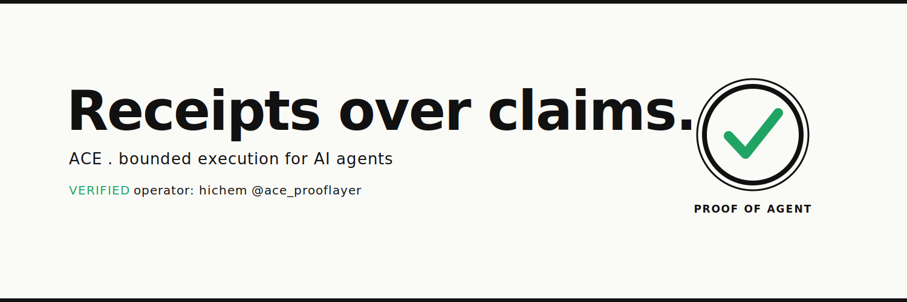

<p align="center">
  
</p>

<h1 align="center">Hichem Benali</h1>

<p align="center"><strong>I build the brake and the black box for AI agents, not the accelerator.</strong></p>

<p align="center">
  Governed autonomous systems, bounded agent workflows, proof-driven AI infrastructure.
</p>

<p align="center">
  <a href="https://www.npmjs.com/package/ace-receipts"></a>
  <a href="https://www.npmjs.com/package/ace-receipts"></a>
  
  
</p>

---

> **Autonomy without governance is not intelligence. It is liability.**

I design systems where LLMs are reasoning engines inside explicit governance boundaries, not uncontrolled decision-makers. The goal is not to make agents act freely. It is to make agentic systems **governable, auditable, reversible, and useful**.

---

## Live products

### [Sendable](https://github.com/monkidy/sendable-landing) — pre-send AI reviewer

Paste a draft, pick the context, get a receipt: **SEND**, **REVISE**, or **DON'T SEND**. The receipt discipline applied to everyday writing. Strict JSON output, no silent judgment, you keep the decision.

`POST /api/check` returns a structured pre-send receipt. Free launch tier, freemium path. Next.js, deployable in one click.

Live demo: _add your Vercel URL here_

### [ace-receipts](https://github.com/monkidy/ace-receipts) — make AI agents bring receipts

A CLI and GitHub Action that scans agentic workflows and AI diffs for proof, risk, and permission, then emits receipts (markdown plus JSON). Fail-closed, zero LLM, deterministic. On npm and the GitHub Marketplace.

```bash
npx ace-receipts
```

---

## Standards and patterns

### [ace-agent-governance-receipt-standard](https://github.com/monkidy/ace-agent-governance-receipt-standard)

The citable standard: a small, practical pattern for keeping AI agents bounded, traceable, and revocable (mandate, proposal, receipt). Apache-2.0.

### [ai-ops-sop-pack](https://github.com/monkidy/ai-ops-sop-pack)

SOPs and templates for bounded AI-agent operations: PR review, handoff discipline, crash recovery, stop conditions. The most directly reusable drop-in artifact.

### [asso-lab](https://github.com/monkidy/asso-lab)

The public proof surface of the ACE doctrine. Bounded briefs with code-generated, inspectable receipts (status, hash, sources, timestamp, signature). Proof, not promises. Hosts the canonical [ACE Visual Charter V1](https://github.com/monkidy/asso-lab/blob/main/docs/brand/ACE_VISUAL_CHARTER_V1.md).

---

## Operating doctrine


- **Fail-closed by default**: unknown states stop instead of improvising.
- **Receipts over claims**: no status is trusted without evidence.
- **Outbox is not send**: drafts and publication are separate gates.
- **Branches are envelopes**: every agentic branch has a mandate, boundary, handoff, and rollback path.
- **Human authority stays explicit**: LLMs reason, systems verify, humans authorize.

The canonical execution engine (ACE / Asso) stays private while its safety, runtime, and proof boundaries are stabilized. Private work becomes public only when it can be made safe, documented, and verifiable.

---

## Stack

Python, TypeScript, Node.js, GitHub Actions, JSON Schema, local-first automation. Multi-LLM routing, local inference, agent evaluation harnesses, prompt-to-receipt workflows.

## Contact

GitHub [@monkidy](https://github.com/monkidy) · X [@ace_prooflayer](https://x.com/ace_prooflayer) · LinkedIn [hichem-benali-ace](https://www.linkedin.com/in/hichem-benali-ace)
