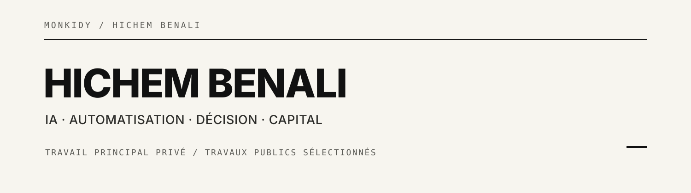

  

# Hichem Benali

I started with databases and production systems. I kept following the problems.

I learn by following a problem until I can build around it. That has taken me through software, products, algorithms, research and into questions about intelligence, knowledge and how complex systems hold together.

I do not like choosing an explanation too early. I would rather keep several alive and let evidence eliminate them.

I like ambitious systems. I just want them to survive contact with reality.

Currently building **SYSTASYS**.

SYSTASYS brings research, decisions, operations and capital into one working system. The core stays private. I publish selected work when it is useful on its own.

## Selected work

**[ace-receipts](https://github.com/monkidy/ace-receipts)**  
A deterministic CLI and GitHub Action for checking workflows and diffs against evidence, risk and explicit permissions.

**[Sendable?](https://sendable-landing.vercel.app)**  
A pre-send review product: paste a message, get a structured verdict, keep the final decision.

## Earlier public work

[AI Ops SOP Pack](https://github.com/monkidy/ai-ops-sop-pack) · [Asso Lab](https://github.com/monkidy/asso-lab) · [Agent Governance Receipt Standard](https://github.com/monkidy/ace-agent-governance-receipt-standard) · [Agent Decision Receipts](https://github.com/monkidy/agent-decision-receipts)

Earlier work on evidence, reliability and controlled execution.

## Contact

[@monkidy](https://github.com/monkidy)
