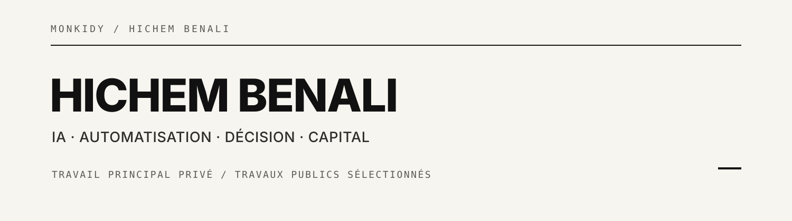

  

# Hichem Benali

I start from the problem, not the field.

I work across software, products, research, people and operations. The public site is the living map of that work. GitHub is narrower on purpose: selected technical objects, proof surfaces and reusable public artifacts.

**Current public map:** https://hichembenali.com

## SYSTASYS

SYSTASYS is the living system behind Asso.

It is the wider organization that connects memory, observation, research, coordination, bounded action, control and learning over time. It is not one giant AI and it is not mirrored publicly as a single repository.

Public room: https://hichembenali.com/systasys

## Asso

Asso is the longitudinal cognitive interface at the centre of the work: continuity, memory, evidence, contradiction, coordination and bounded operation across time.

The better Asso knows the context, the more useful it should become. More context does not create more authority.

Public room: https://hichembenali.com/asso

## Selected public work

These repositories are public objects from the wider work. They are not a mirror of the private SYSTASYS operating system and they should be evaluated on their own problem, evidence and limits.

### Maintained public objects

**[ACE Receipts](https://github.com/monkidy/ace-receipts)**  
A deterministic CLI + GitHub Action that checks AI-assisted workflows and diffs for proof, risk and explicit permission. `ACE Receipts` remains a historical product name; it is not the parent identity of SYSTASYS.

**[Asso Lab](https://github.com/monkidy/asso-lab)**  
A bounded public observation surface derived from Asso: briefs, receipts, evidence, refusals and reviewable agent actions.

**[AI Ops SOP Pack](https://github.com/monkidy/ai-ops-sop-pack)**  
Documentation-only SOPs for reviewing AI-assisted engineering work, recovery, handoff discipline and stop conditions.

**[Agent Decision Receipts](https://github.com/monkidy/agent-decision-receipts)**  
A small public proof notebook for readable action receipts: intent, permission, evidence, refusal, decision and closeout.

### Historical public reference

**[ACE Agent Governance Receipt Standard](https://github.com/monkidy/ace-agent-governance-receipt-standard)**  
An early public receipt/governance standard kept visible for provenance and reuse. It is a historical reference, not the current architecture or parent identity of Asso or SYSTASYS.

## Public / private boundary

The public repositories show bounded artifacts that can be inspected independently.

They do **not** expose or claim to prove the private SYSTASYS runtime, live infrastructure, broker/economic state, internal control surfaces or current terrain state. Those are separate layers with separate evidence.

The website carries the current public narrative. GitHub carries selected technical proof.

## Evidence

Public site: https://hichembenali.com  
Traces: https://hichembenali.com/traces

I prefer inspectable objects to self-awarded adjectives.

**Evidence over claims.**
