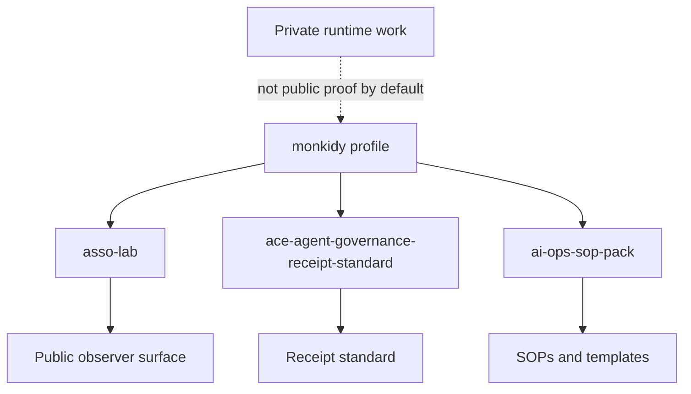

# Visual overview

This page gives a one-screen map of the public ACE / Asso GitHub surface.

## One-line idea

> Build agentic systems that stay bounded, reviewable, and evidence-driven.

## Public surface map



Plain meaning:

1. This profile orients readers.
2. `asso-lab` shows public observer artifacts and receipts.
3. `ace-agent-governance-receipt-standard` defines a small receipt pattern.
4. `ai-ops-sop-pack` provides practical SOPs and templates.
5. Private runtime work is not public proof by default.

## Reader map

| Reader | Start with | Why |
| --- | --- | --- |
| New visitor | `README.md` | Understand the thesis and repo map |
| Builder | `ace-agent-governance-receipt-standard` | Learn mandate, proposal, receipt, refusal shape |
| Operator | `ai-ops-sop-pack` | Use SOPs and templates for handoff/review |
| Reviewer | `asso-lab` | Inspect public receipts and proof surface |
| Safety / risk reader | `STATUS.md` | See what is and is not claimed |

## Claim discipline

| Claim type | Accept only when |
| --- | --- |
| Public artifact exists | Linked repo/file is inspectable |
| Receipt exists | Receipt file is inspectable |
| Runtime is safe | Separate runtime evidence exists |
| Production-ready | Public evidence supports that exact claim |
| Permission-to-act | Explicit authority and gate exist |

## Mental model

```text
Profile -> orientation, not proof
Public repo -> inspectable artifact
Receipt -> evidence trail
Private runtime -> not public proof by default
Claim -> only as strong as its evidence
```

## Doctrine in one screen

```text
Closed by Default
Evidence First
Human Bounds
Receipts over Claims
Fail Closed
Revocable by Design
```
