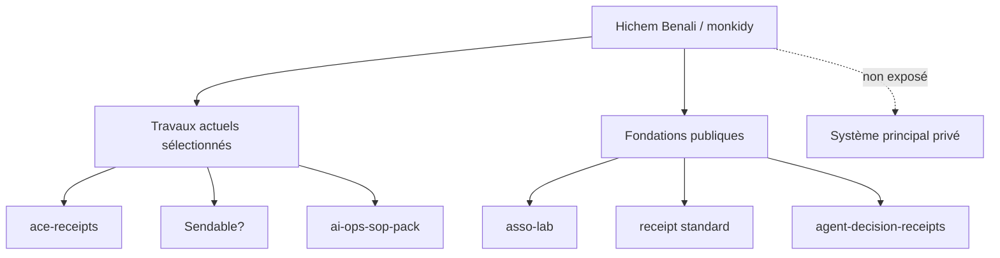

# Vue d'ensemble publique

Cette page résume la logique du profil `@monkidy` en un écran.

## Lecture rapide

```text
Hichem Benali
  -> travail principal privé
  -> quelques travaux publics sélectionnés
  -> fondations techniques historiques accessibles
```

Le profil ne cherche pas à reproduire publiquement le système privé.

Il montre seulement ce qui peut être exposé sans compromettre le cœur du travail.

## Surface publique


```mermaid
flowchart TD
    A[Hichem Benali / monkidy] --> B[Travaux actuels sélectionnés]
    A --> C[Fondations publiques]
    A -. non exposé .-> D[Système principal privé]

    B --> E[ace-receipts]
    B --> F[Sendable?]
    B --> G[ai-ops-sop-pack]

    C --> H[asso-lab]
    C --> I[receipt standard]
    C --> J[agent-decision-receipts]
```

## Hiérarchie de lecture

| Niveau | Ce qu'un visiteur doit comprendre |
| --- | --- |
| 10 secondes | Hichem construit aujourd'hui des systèmes autour de l'IA, de l'automatisation, de la décision et du capital |
| 1 minute | Son travail principal est privé, mais plusieurs outils et produits sont inspectables publiquement |
| 5 minutes | Les anciens travaux ACE expliquent une partie de la discipline de preuve, de contrôle et de traçabilité |
| Plus loin | Le public peut constater la méthode, pas reconstruire le moteur privé |

## Direction visuelle active

La surface active utilise `brand/hichem-profile-banner.svg`.

Principes :

- Hichem avant une marque ou un produit ;
- noir, ivoire et gris neutres ;
- pas de badge décoratif dans le hero ;
- pas de vocabulaire visuel de trading, crypto ou IA générique ;
- pas de logo ACE comme identité personnelle ;
- typographie et hiérarchie avant effets graphiques ;
- lisible sur mobile et en thème clair ou sombre autant que possible.

Les anciens assets ACE restent dans `brand/` comme traces historiques du profil. Ils ne sont plus utilisés comme identité visuelle active.

## Discipline de publication

```text
PUBLIC != PRIVATE EXTRACT
```

Un artefact public doit être autonome, volontairement publiable et nettoyé de tout secret, configuration live, donnée sensible ou logique propriétaire qui n'a aucune raison de sortir.

Un repo public n'est pas une preuve du système privé. Un système privé n'est pas une excuse pour faire des affirmations invérifiables en public.
